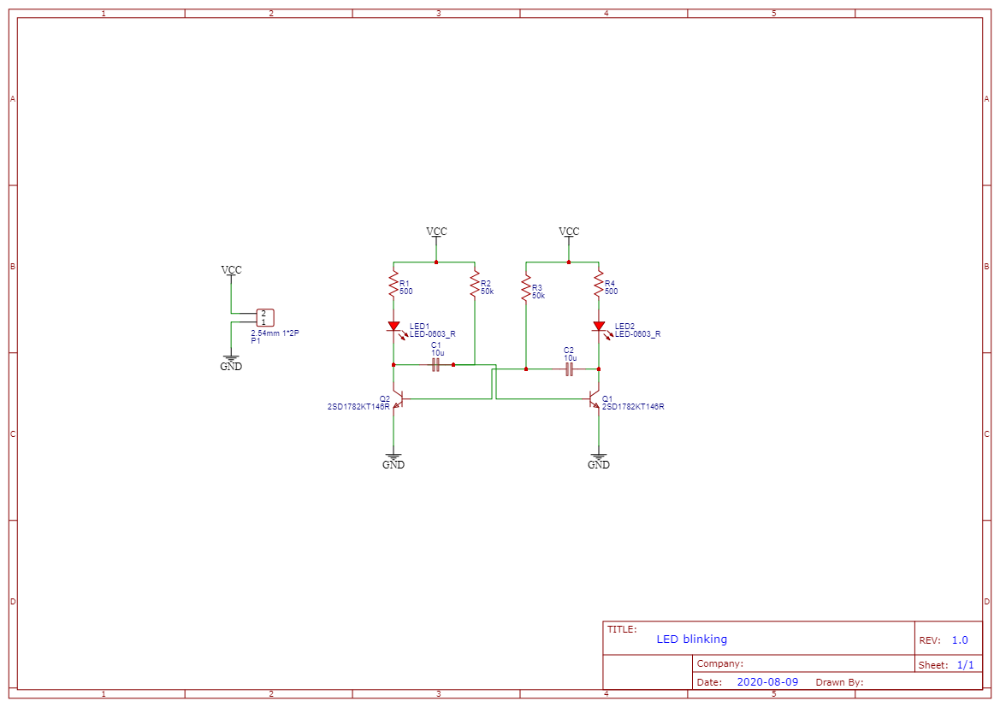

# LED blinking

A test of an blinking LED design.

## Simulation

You can run a simulation of the design [here](http://www.falstad.com/circuit/circuitjs.html?ctz=CQAgjCAMB0l3BWEBOWkwHYwGYeIExgAcECkISZFApgLRhgBQA7iPpESNtgGxsdsinJpnwgeAFnD5OklH3IYKy8quhIAIgCcAhgEsAdiABqAewA2AFx0Bzaoxv9OvTu04S4UKA65EpL3ykPVW9WbD8uXkDBYUYtJwS3aU5ybDg46KTwqTAZLzTIRgBjTKEQCQlXMrV4OAgwaAYJZHwEZGx2TGxkARg64rYMMRlXARGvPtqIWmxYMB5kIkh8DAkEDCIeVqlJkS3EsbGysQATagAzHQBXK1pzahOvCBq9sWyE9-HTi+vb+8eQs85hkVsNjkNkk9ahkKlV3JVIeQwNDLIM3ghhgJsBiniBaBJoAsMOgeus2hUcfRYIRkMhmhJiEsJPg+MjyGdLjdLIxUbCuDj3tixEioOoeDwGAhcuh8BJJO1RTw2pA5QxlhKJTlPBzftzUcg+EKuOjheBRes8DwVXAPM0VoqEEzsgxscElGyQDquRkDTF5IjwNCwmJcrIcnlCvM3pjnGDXJ6fly7g8zSE+kwSr7xh0-TUpuahmkiGlkPMeMS2qL+vEc1kQxGuOlHDmAjnghMWMbIoa4+BGOwlL6jaH+WIpAAhfuQJR88aVchzkAAYSnSlBo8b-hxUhXA-94xHi4Agqu0X60lJF5O93yjfON1IT6w5CPfSPCqxZUi8uv352koeHiIowohsEBgHkL6ijKEgabqCA2j6EYZhWLY9isAyrJ5Hyf5hBEI6YcBoGEQR8z+tBlATOaCG6IYJgWNYdiMKYbB8HI5AeLSbDwemrReMMhrMYM4g7OUkBcfgPFzHxC7CdgQmyiJXiccg3GwWgWywWwYFcIwQA).

## Licence

Copyright © 2020, 2021, 2022 Phil Baldwin

This work is licensed under a Creative Commons Attribution-ShareAlike 4.0 International License.

You should have received a copy of the license along with this work. If not, see <http://creativecommons.org/licenses/by-sa/4.0/>.
